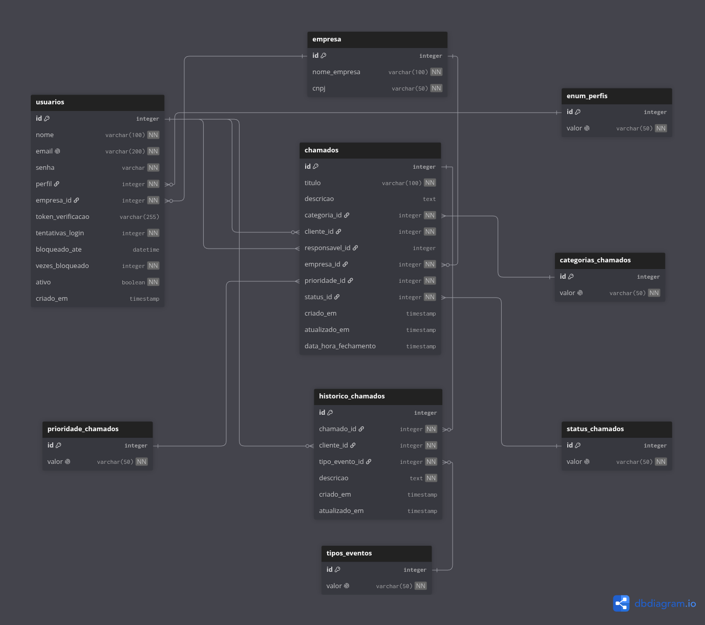

# HelpTrack

SaaS multi-tenant de Gerenciamento de Chamados Técnicos de T.I

## Stack Utilizada

- **FastAPI e Python** - Desenvolvimento das APIs
- **SQLAlchemy** - ORM (Ferramenta para fazer queries no banco com o paradigma de POO)
- **Alembic** - Migrations para criação e versionamento de versões do banco
- **Docker** - Criação de containers para orquestração, isolamento e facilitação de deploy
- **PostgreSQL** - Banco de Dados Relacional
- **Adminer** - Visualização prática das tabelas e seus valores no banco
- **Github Actions** - Criação de Pipelines de CI/CD (Continuous Integration e Continuos Delivery)
- **AWS** - Servidor remoto onde o projeto roda
- **PyTest** - Testes Unitários para as APIs

## Como rodar o projeto

Certifique-se de ter o Docker instalado!

**Passo 1** - Clonar repo

```
git clone <url do repositório>
```

**Passo 2** - Renomear .env 
```
cp .env-example .env
```

**Passo 3** - Criar ambiente virtual 
```
# Crie o ambiente virtual
python3 -m venv venv

# Ative o ambiente virtual
source venv/bin/activate
```


**Passo 4** - Comando docker para rodar 
```
docker compose up -d --build
```

## Estrutura do Projeto
```
helptrack-backend
    /.github
    /alembic
    /app
        /database
        /models
        /routes
        /schemas
        /seeds
        /services
        main.py
    .env-example
    .gitignore
    alembic.ini
    docker-compose.yml
    Dockerfile
    README.md
    requirements.txt
```

## Padrão de Commits

Os commits devem seguir o **padrão semântico**:

- `feat:` Nova funcionalidade.
- `fix:` Correção de bug.
- `docs:` Alteração na documentação.
- `style:` Mudanças de formatação (sem impactar código funcional).
- `refactor:` Refatoração de código.
- `test:` Adição/alteração de testes.
- `chore:` Tarefas de manutenção (ex: CI/CD, dependências).

Exemplo:
```sh
feat: adicionar autenticação JWT
fix: corrigir erro ao carregar configurações
```

## Arquitetura

- **database** -> conexão com o banco
- **models** -> modelos das entidades do banco
- **routes** -> recebem e tratam requisições
- **schemas** -> validam entrada das requisições
- **services** -> regras de negócio
- **core** -> núcleo do sistema (elementos globais)

## Diagramas

### Diagrama ER



### Diagrama Caso de Uso

.png>)